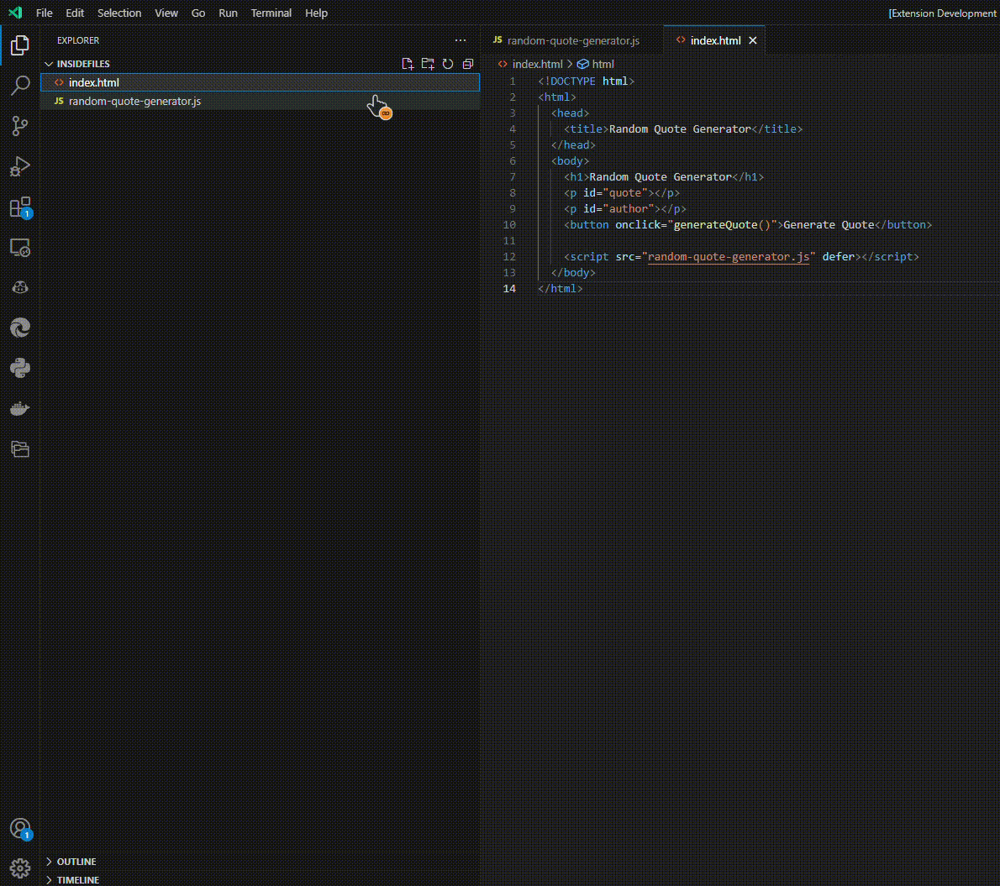

# gpt-contextfiles


> if you'll like to contribute or provide any feedback check out the [link](https://github.com/Iheuzio/gpt-contextfiles/issues)

This extension uses the openai api, there are many models avaliable:

https://openai.com/pricing

> However, being orientated with managing files this project defaults to the 16k context with GPT-3.5-turbo-16k

If you wish to change the model, you must change the model in the extension.js file

# Examples

Demo of how to use the extension:



# Installation

Add your api key to `OPENAI_API_KEY` for your windows/linux environment variable (tested with system variable)

# Features

Clear -> Clears the files currently available

Submit -> Submits the query to the api

Refresh -> refreshes the window so that all new files will be available for that session.

- Right click to add files to the context window
- Click on the extension addon to open the context window, refresh to update the files to check.
- Select the files uses checkboxes
- Wait for response to be returned

Other features:

- Click copy to to copy the snippet of code into your file for fast coding

# How it works

We can select two files we want to pass through, however we can uncheck one of them for later debugging and enter our question:

```
What does this do?
c:\dev\test\gpt-contextfiles-test\program.js:
\```
	window.alert("Hello World!")
\```
```

Functions based on the principle of files passed into it
```
Selected Files:
[x] c:\dev\test\gpt-contextfiles-test\program.js
[ ] c:\dev\test\gpt-contextfiles-test\program2.js
```
